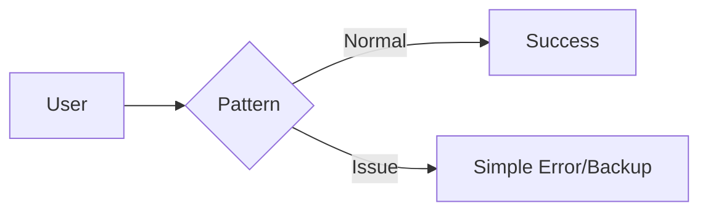

# 🏗️ {Pattern Name}

> *[A simple, one-sentence explanation of what this does.]*

---

## 💡 What is it?
* **Simple Analogy:** [e.g., "Like a safety switch in your house that flips when there is too much power."]
* **In Plain English:** [1-2 sentences explaining the concept without using heavy jargon.]

## ⚙️ How it Works

**The Flow:**
1. **Request:** The user or service sends a request.
2. **Intercept:** This pattern intercepts the request to check the system status.
3. **Route:**
   - If everything is **OK**, it proceeds to the target resource.
   - If there is an **Issue**, it immediately triggers a fallback to protect the system.

## ✅ Pros & ❌ Cons
**Pros (+):**
* [Benefit 1: e.g., Stops one failing service from breaking the whole system.]
* [Benefit 2: e.g., Gives the system a chance to recover.]

**Cons (-):**
* [Downside 1: e.g., Users might see an error message instead of waiting.]
* [Downside 2: e.g., Needs a bit more code to set up.]

## 🧭 Decision Compass 
* If you need to define [Specific Requirement], explore [[Pattern Name Y]](pattern-y.md). 
* When [Situation X] occurs, you might need to pivot from this pattern to [[Pattern Name Z]](pattern-z.md). 
* This pattern provides the foundation for [[Pattern Name W]](pattern-w.md). 

---

## 📑 Read more
*This pattern is discussed or applied in the following articles:*

* 📝 [Blog Title 1 - Click to Read](https://qianarthurwang.substack.com/)
* 📝 [Blog Title 2 - Click to Read](https://qianarthurwang.substack.com/)
