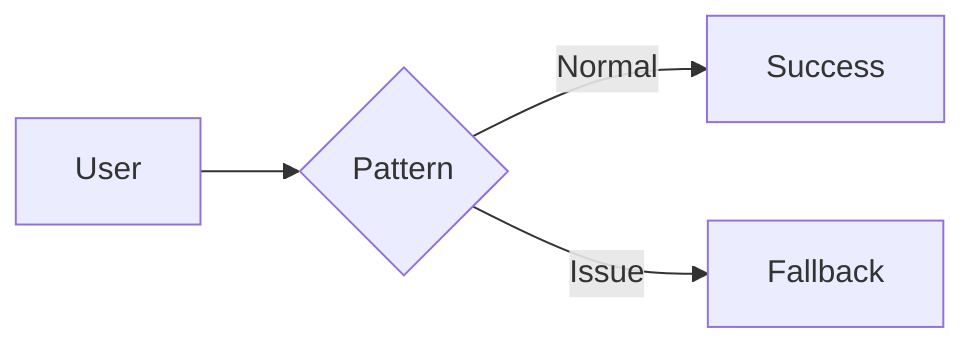

# 🏗️ {Pattern Name}

> *[A simple, one-sentence explanation of what this does.]*

---

## 💡 What is it?
* **Simple Analogy:** [e.g., "Like a safety switch in your house."]
* **In Plain English:** [1-2 sentences explaining the concept.]

## ⚙️ How it Works

**The Flow:**
1. **Request:** The user sends a request.
2. **Intercept:** The pattern checks system status.
3. **Route:** Proceed if OK; fallback if an issue is detected.

## ⚖️ The Architect's Trade-off & Decision Compass

### 💰 What you are "buying"
* **[Benefit 1]:** What specific problem does this solve at scale?
* **[Benefit 2]:** How does it simplify the system or protect it?

### 📉 The "Tax" you pay
* **[Complexity/Cost]:** Does it increase latency? Does it make debugging harder?
* **[Operational Burden]:** What does the on-call engineer need to worry about?

### 🧭 Decision Triggers
* **Move to [[Pattern B]](pattern-b.md)** if you encounter **[Situation X]**.
* **Combine with [[Pattern C]](pattern-c.md)** if you need **[Requirement Y]**.
* **Avoid this pattern** if your system **[Specific Constraint]**.

---

## 📑 Read more
* 📝 [Blog Title 1](https://qianarthurwang.substack.com/)
