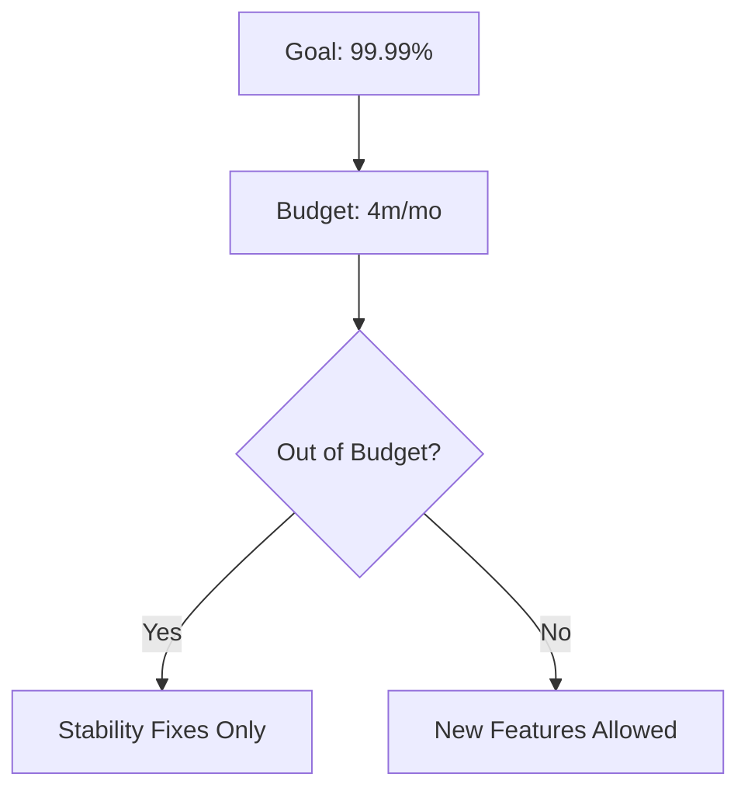

# 🏗️ Availability Math

> *The mathematical foundation for calculating system uptime and the exponential cost of "The Nines".*

---

## 💡 What is it?
* Like a phone battery—maintaining exactly 100.000% at all times is nearly impossible and very expensive.
* Quantifies the "Certainty" you can afford. Each "9" you add reduces your mistake allowance.

## ⚙️ How it Works

## ⚖️ The Architect's Trade-off & Decision Compass

### 💰 What you are "buying"
* **Risk Management:** A clear error budget that tells you when it's safe to deploy and when you must stop.
* **Objective Priority:** Ends arguments between Product (features) and Engineering (reliability).

### 📉 The "Tax" you pay
* **Engineering Fatigue:** High availability (4+ nines) often requires 24/7 on-call rotations and expensive automated failover infrastructure.
* **Diminishing Returns:** The cost to move from 99.9% to 99.99% is often 10x higher, but users might not even perceive the difference.

### 🧭 Decision Triggers
* Move to [[Timeouts & Deadlines]](timeouts.md) if your math shows that slow downstream services are the primary reason you are blowing your error budget.
* Introduce [[Redundancy]](redundancy.md) if you need to be more stable than your underlying foundation. *Formula: Two 99.9% nodes in parallel = 99.9999% availability.*
* Watch out for "Shared Fate". If your primary and backup dependencies share the same DNS, same ISP, or same Cloud Region, your backup is an illusion. Your math will lie to you.
* Stop chasing "Five Nines" if your business doesn't have the budget to build independent redundancy across different failure domains.
