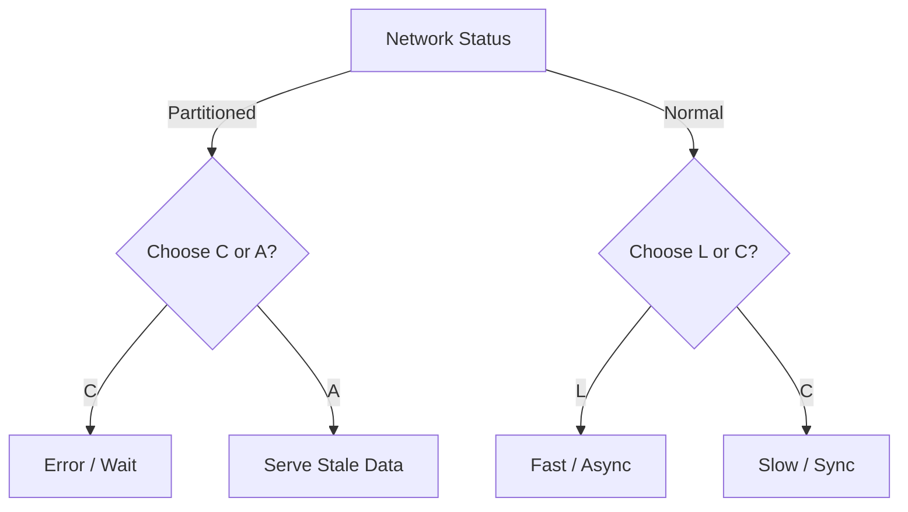

# 🏗️ CAP & PACELC

> *A framework to understand the trade-offs between consistency, availability, and latency in both disaster and normal states.*

---

## 💡 What is it?
* CAP (Consistency, Availability, Partition Tolerance) is like a fire escape plan.
* PACELC (Partition, Availability, Consistency, Else, Latency, Consistency) is like choosing your daily commute (speed vs. reliability).
* It defines what you sacrifice when the network is broken (partition) and what you sacrifice when it's healthy (latency vs. consistency).

## ⚙️ How it Works

## ⚖️ The Architect's Trade-off & Decision Compass

### 💰 What you are "buying"
* **Mental Clarity:** A rigorous way to explain to stakeholders why the system is slow or why data is wrong.
* **Global Scalability:** The ability to prioritize user experience (latency) in multi-region deployments.

### 📉 The "Tax" you pay
* **Abstract Complexity:** It's a theoretical model; mapping it to specific database configurations requires deep expertise.
* **Risk of Stale Data:** Choosing A/L means the application layer must handle conflicting or old information.

### 🧭 Decision Triggers
* Move to [[Consistency Models]](consistency-models.md) if you need to define the exact *window* of staleness (e.g., "how long is eventually?").
* Pivot to [[Availability Math]](availability-math.md) if you need to calculate the actual financial cost of choosing consistency over availability.
* Avoid over-optimizing for consistency in user-facing social features where a 1-second lag in "likes" is invisible but a 1-second UI freeze is fatal.
