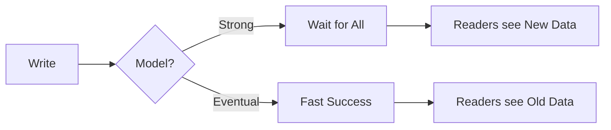

# 🏗️ Consistency Models

> *A contract defining how and when data updates become visible to different observers.*

---

## 💡 What is it?
* Strong Consistency is a live concert; Eventual Consistency is reading the review in the paper the next day.
* It’s the tactical implementation of the "consistency vs latency" choice. You trade speed of delivery for the freshness of the data.

## ⚙️ How it Works

## ⚖️ The Architect's Trade-off & Decision Compass

### 💰 What you are "buying"
* **System Throughput:** Eventual consistency allows you to handle 10x more traffic by removing global locks.
* **User Resilience:** Users in different regions get local-speed performance.

### 📉 The "Tax" you pay
* **Developer Cognitive Load:** Developers can no longer assume "Read-After-Write" works perfectly. They must write code that handles "time-traveling" data.
* **Complex Debugging:** Race conditions become non-deterministic and hard to reproduce in staging.

### 🧭 Decision Triggers
* Move to [[CAP & PACELC]](cap-pacelc.md) to justify why you are moving away from Strong Consistency to the business team.
* Shift to Strong Consistency immediately if you are handling distributed transactions or financial balances where "eventual" means "wrong money."
* Combine with [Idempotency](idempotency.md) if using Eventual Consistency to ensure retried writes don't create duplicate entries.
