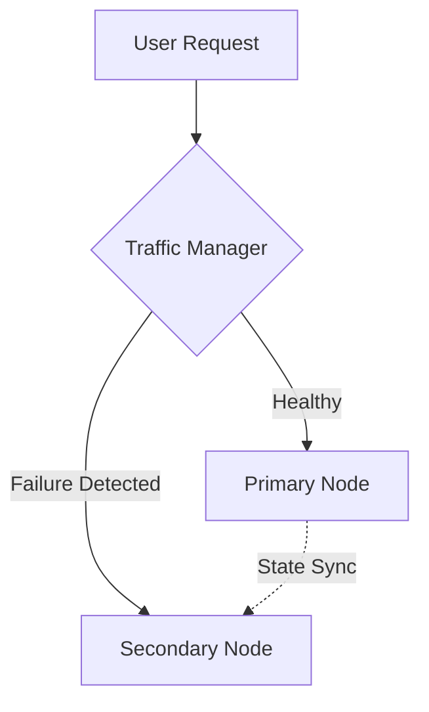

# 🏗️ Redundancy

> *The practice of duplicating critical components of a system to eliminate single points of failure.*

---

## 💡 What is it?
* Like having a spare tire in your car. It doesn't make the car faster, but it ensures you aren't stranded if one tire goes flat.
* It’s the Plan B of the infrastructure. You run extra copies of servers or networks so that when one fails, another is ready.

## ⚙️ How it Works

## ⚖️ The Architect's Trade-off & Decision Compass

### 💰 What you are "buying"
* **Fault Tolerance:** You can survive a server crash, a rack outage, or even a regional failure without user impact.
* **No-Downtime Maintenance:** You can take one node down for updates while the redundant node handles the traffic.

### 📉 The "Tax" you pay
* **Infrastructure Cost:** You are paying for 2x or 3x the resources, some of which may sit idle most of the time.
* **State Sync Complexity:** Ensuring the backup has the same data as the primary (consistency) is a classic challenge.

### 🧭 Decision Compass
* Use [[Availability Math]](availability-math.md) to determine if you need N+1 or 2N redundancy to hit your target uptime.
* Combine with [[Timeouts & Deadlines]](timeouts.md) to detect a failed node quickly and switch to the redundant one.
* Watch for "Shared Fate". If your redundant node is in the same cloud region as your primary, you haven't bought true certainty. For total shielding, consider multi-region redundancy.
