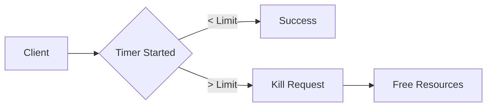

# 🏗️ Timeouts & Deadlines

> *A protective mechanism that limits how long a system will wait, preventing local delays from becoming global outages.*

---

## 💡 What is it?
* If your friend is 20 minutes late to a cafe, you leave so you don't waste your entire day waiting.
* It’s the "fail-fast" tool. It frees up threads and memory instead of letting them hang in uncertainty.

## ⚙️ How it Works

## ⚖️ The Architect's Trade-off & Decision Compass

### 💰 What you are "buying"
* **Fault Isolation:** Prevents a single slow dependency from stacking up and crashing your entire service.
* **Deterministic Latency:** Ensures your P99 latency is capped, making system performance predictable for users.

### 📉 The "Tax" you pay
* **Incomplete Work:** You might kill a request that was 99% done, leading to partial state or inconsistencies.
* **Operational Noise:** Setting timeouts too aggressively causes false positive errors during minor network jitters.

### 🧭 Decision Triggers
* Pivot to [[Redundancy]](redundancy.md). If a timeout occurs on your primary node, use the remaining deadline to try a secondary, independent provider.
* Move to [[Retries & Exponential Backoff]](backoff.md) if the timeout happens on a non-critical, idempotent task.
* Switch to a [[Circuit Breaker]](circuit-breaker.md) if timeouts are happening consistently. Stop the bleeding instead of just failing slowly.
